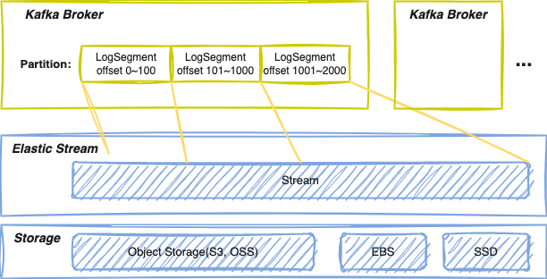

<h1 align="center">
AutoMQ for Apache Kafka
</h1>
<h3 align="center">
    The truly serverless Kafka solution that maximizes the benefits of cloud
</h3>

## What is AutoMQ for Apache Kafka
AutoMQ for Apache Kafka is redesigned based on cloud infrastructure, and users 
benefit from 
**elastic computing resources** and nearly **unlimited cheap storage** in 
the cloud. It is developed based on Apache Kafka and replace Kafka's local storage with  [Elastic Stream](https://github.com/AutoMQ/elastic-stream). This design allows Kafka Brokers to become stateless and could scale up/down in seconds. And by making targeted modifications at the LogSegment level and extensively reusing upper-level code, it guarantees **100% functional compatibility**.

Compared to Apache Kafka, AutoMQ for Apache Kafka offers the following advantages:

1. Enhanced Scalability: It leverages cloud-native infrastructure and stateless Kafka Brokers, enabling seamless scaling to meet varying workloads. This elasticity allows for efficient resource allocation and ensures optimal performance even during peak periods.

2. Cost Efficiency: By utilizing object storage(S3), it could save storage cost up to 70%; By leveraging serverless architecture and dynamically scaling based on workload, it can achieve significant cost savings of up to 80% in compute expenses.

3. Simplified Management: It automatically balances the distribution of partitions across brokers in seconds. This streamlines operations, reduces administrative overhead, and allows IT teams to focus on higher-value tasks.


## Quick Start
### Build
To build AutoMQ for Apache Kafka, you need to install JDK 8/11/17 and Scale 
2.13

Building a binary release gzipped tar ball
``` shell
./gradlew clean releaseTarGz
```
The release file can be found inside `./core/build/distributions/`.

### Run
> Currently, only Linux is supported.
#### Launch Elastic Stream
See [Elastic Stream](https://github.com/AutoMQ/elastic-stream).

#### Launch AutoMQ for Apache Kafka
``` shell
# unpack the release file
$ cd core/build/distributions; tar xvf kafka_2.13-3.4.0.tgz; cd kafka_2.13-3.4.0

# start a broker in kraft mode
$ KAFKA_CLUSTER_ID="$(./bin/kafka-storage.sh random-uuid)"

$ ./bin/kafka-storage.sh format -t $KAFKA_CLUSTER_ID -c config/kraft/server.
properties

$ ./bin/kafka-server-start.sh config/kraft/server.properties
```

#### Run console pub-sub
1. Create a topic to store your events:
``` shell
$ bin/kafka-topics.sh --create --topic quickstart-events --bootstrap-server 
localhost:9092
```

2. Run the console producer client to write a few events into your topic. By default, each line you enter will result in a separate event being written to the topic.
``` shell
$ bin/kafka-console-producer.sh --topic quickstart-events --bootstrap-server localhost:9092
This is my first event
This is my second event
```

3. Open another terminal session and run the console consumer client to read the events you just created:
``` shell
$ bin/kafka-console-consumer.sh --topic quickstart-events --from-beginning --bootstrap-server localhost:9092
This is my first event
This is my second event
```
ref. [Quick Start](https://kafka.apache.org/quickstart#quickstart_send)

After run producer and consumer, you can check Kafka local store path /tmp/kraft-combined-logs/quickstart-events-0, you will find there is no local data for quickstart-events.
> Note: xxx.timeindex is only the local cache for read accelerate,
> the real data is stored in Elastic Stream.

## Design


