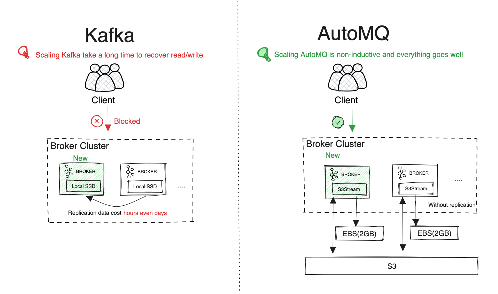
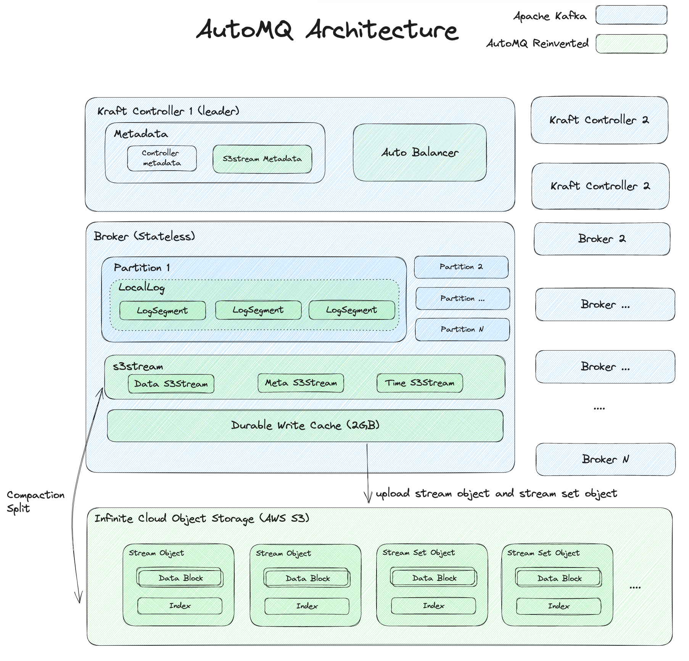

<h1 align="center">
AutoMQ: A Cloud-Native fork of Kafka by separating storage to S3
</h1>
<h3 align="center">

</h3>


---
[](https://www.automq.com)
&nbsp;
[](https://docs.automq.com/docs/automq-s3kafka/YUzOwI7AgiNIgDk1GJAcu6Uanog)
&nbsp;
[-yellow)]([https://www.automq.com](https://www.automq.com/blog/automq-vs-apache-kafka-a-real-aws-cloud-bill-comparison))
&nbsp;
[-orange)]([https://www.automq.com](https://docs.automq.com/docs/automq-s3kafka/CYxlwqDBHitThCkxSl2cePxrnBc))
&nbsp;
[](https://twitter.com/intent/follow?screen_name=AutoMQ_Lab)</a>
&nbsp;
<a href="docs/images/automq-wechat.png" target="_blank"></a>
&nbsp;

---


      


[//]: # ([![E2E_TEST]&#40;https://github.com/AutoMQ/automq-for-kafka/actions/workflows/nightly-e2e.yml/badge.svg&#41;]&#40;https://github.com/AutoMQ/automq-for-kafka/actions/workflows/nightly-e2e.yml&#41;)

## 🍵 AutoMQ vs Other Streaming Platforms


<table>
  <tr>
    <th>Feature</th>
    <th>AutoMQ</th>
    <th>Apache Kafka</th>
    <th>Confluent</th>
    <th>Apache Pulsar</th>
    <th>Redpanda</th>
    <th>Warpstream</th>
  </tr>
  <tr>
    <td>Apache Kafka Compatibility[1]</td>
    <td>Native Kafka</td>
    <td>Native Kafka</td>
    <td>Native Kafka</td>
    <td>Non-Kafka</td>
    <td>Kafka Protocol</td>
    <td>Kafka Protocol</td>
  </tr>
  <tr>
    <td>Source Code Availability</td>
    <td>Yes</td>
    <td>Yes</td>
    <td>No</td>
    <td>Yes</td>
    <td>Yes</td>
    <td>No</td>
  </tr>
  <tr>
    <td>Stateless Broker</td>
    <td>Yes</td>
    <td>No</td>
    <td>No</td>
    <td>Yes</td>
    <td>No</td>
    <td>Yes</td>
  </tr>
  <tr>
    <td>P99 Latency</td>
    <td colspan="5">Single-digit<br> ms latency</td>
    <td><a href="https://www.warpstream.com/blog/kafka-is-dead-long-live-kafka">> 400ms</a></td>
  </tr>
  <tr>
    <td>Continuous Self-Balancing</td>
    <td>Yes</td>
    <td>No</td>
    <td>Yes</td>
    <td>Yes</td>
    <td>Yes</td>
    <td>Yes</td>
  </tr>
  <tr>
    <td>Scale in/out</td>
    <td>In seconds</td>
    <td>In hours/days</td>
    <td>In hours</td>
    <td>In hours<br>(scale-in);<br> In seconds<br>(scale-out)</td>
    <td>In hours/In seconds (Enterprise Only)</td>
    <td>In seconds</td>
  </tr>
  <tr>
    <td>Spot Instance Support</td>
    <td>Yes</td>
    <td>No</td>
    <td>No</td>
    <td>No</td>
    <td>No</td>
    <td>Yes</td>
  </tr>
  <tr>
    <td>Partition Reassignment</td>
    <td>In seconds</td>
    <td>In hours/days</td>
    <td>In hours</td>
    <td>In seconds</td>
    <td>In hours/In seconds (Enterprise Only)</td>
    <td>In seconds</td>
  </tr>
  <tr>
    <td>Component</td>
    <td>Broker</td>
    <td colspan="2">Broker<br>Zookeeper<br>(Non-KRaft)</td>
    <td>Broker<br>Zookeeper<br>Bookkeeper<br>Proxy(Optional)</td>
    <td>Broker</td>
    <td>Agent<br>MetadataServer</td>
  </tr>
  <tr>
    <td>Durability</td>
    <td>Guaranteed by S3/EBS[2]</td>
    <td colspan="2">Guaranteed by ISR </td>
    <td>Guaranteed by Bookkeeper</td>
    <td>Guaranteed by Raft</td>
    <td>Guaranteed by S3</td>
  </tr>
  <tr>
    <td>Inter-AZ Networking Fees</td>
    <td>No</td>
    <td colspan="4">Yes</td>
    <td>No</td>
  </tr>
</table>


> [1] Apache Kafka Compatibility's definition is coming from this [blog](https://www.kai-waehner.de/blog/2021/05/09/kafka-api-de-facto-standard-event-streaming-like-amazon-s3-object-storage/).

> [2] EBS Durability: On Azure, GCP, and Alibaba Cloud, Regional EBS replicas span multiple AZs. On AWS, ensure durability by double writing to EBS and S3 Express One Zone in different AZs.

## 🔶Why AutoMQ

- **Cloud Native**: Built on cloud service. Every system design decision takes the cloud service's feature and billing items into consideration to offer the best low-latency, scalable, reliable, and cost-effective Kafka service on the cloud.
- **High Reliability**: Leverage the features of cloud service to offer RPO of 0 and RTO in seconds. 
  - AWS: Use S3 express one zone and S3 to offer AZ-level disaster recovery. 
  - GCP: Use regional SSD and cloud storage to offer AZ-level disaster recovery. 
  - Azure: Use zone-redundant storage and blob storage to offer AZ-level disaster recovery.
- **Serverless**:
    - Auto Scaling: Watch key metrics of cluster and scale in/out automatically to match your workload and achieve pay-as-you-go.
    - Scaling in seconds: The computing layer (broker) is stateless and can scale in/out in seconds, which makes AutoMQ truly serverless. [Learn more](https://docs.automq.com/docs/automq-s3kafka/Eo4Bweg4eiPegykLpAycED1yn7g)
    - Infinite scalable: Use the cloud's object storage as the main storage, never worry about storage capacity.
- **Manage-less**: Built-in auto-balancer component balance partition and network traffic across brokers automatically. Never worry about partition re-balance. [Learn more](https://docs.automq.com/docs/automq-s3kafka/GSN2wZjeWiR70YkZiRsc6Hqsneh)
- **Cost effective**: Leveraging object storage as the primary storage solution, incorporating billing considerations into the system design, and maximizing the use of cloud services collectively enable AutoMQ to be 10x more cost-effective than Apache Kafka. Refer to [this report](https://docs.automq.com/docs/automq-s3kafka/EJBvwM3dNic6uYkZAWwc7nmrnae) to see how we cut Apache Kafka billing by 90% on the cloud.
- **High performance**:
    - Low latency: Use cloud block storage like AWS EBS as the WAL(Write Ahead Log) to accelerate writing.
    - High throughput: Use pre-fetching, batch processing, and parallel to achieve high throughput.
  > Refer to the [AutoMQ Performance White Paper](https://docs.automq.com/docs/automq-s3kafka/CYxlwqDBHitThCkxSl2cePxrnBc) to see how we achieve this.
- **A superior alternative to Apache Kafka**: 100% compatible with Apache Kafka greater than 0.9.x and not lose any good features of it, but cheaper and better.




## ✨Architecture



AutoMQ uses logSegment as a coding aspect of Apache Kafka to weave into our features. The architecture includes the following main components:
- **S3Stream**: A streaming library based on object storage offered by AutoMQ. It is the core component of AutoMQ and is responsible for reading and writing data to object storage. [Learn more](https://docs.automq.com/docs/automq-s3kafka/Q8fNwoCDGiBOV6k8CDSccKKRn9d).
- **Stream**: Stream is an abstraction for mapping the logSegment of Apache Kafka. LogSegment's data, index, and other metadata will map to different types of streams. [Learn more](https://docs.automq.com/docs/automq-s3kafka/GUk7w0ZxniPwN7kUgiicIlHkn9d)
- **WAL**: AutoMQ uses a small-size cloud block storage like AWS EBS as the WAL(Write Ahead Log) to accelerate writing. Pay attention that this is not tiered storage and the AutoMQ broker can decoupled from the WAL completely. [Learn more](https://docs.automq.com/docs/automq-s3kafka/X1DBwDdzWiCMmYkglGHcKdjqn9f)
- **Stream set object**: A Stream Set Object aggregates data from multiple streams into individual segments, significantly cutting down on object storage API usage and metadata size. [Learn more](https://docs.automq.com/docs/automq-s3kafka/Q8fNwoCDGiBOV6k8CDSccKKRn9d)
- **Stream Object**: A Stream Object contains data from a single stream, typically separated when compacting Stream Set Objects for streams with larger data volumes. [Learn more](https://docs.automq.com/docs/automq-s3kafka/Q8fNwoCDGiBOV6k8CDSccKKRn9d)

## ⛄Get started with AutoMQ

### Quick Start With A Single Line
```
curl https://download.automq.com/install.sh | sh
```

The easiest way to run AutoMQ. You can experience features like **Partition Reassignment in Seconds** and **Continuous Self-Balancing** in your local machine. [Learn more](https://docs.automq.com/docs/automq-s3kafka/SMKbwchB3i0Y0ykFm75c0ftAnCc)

> Attention: Local mode mock object storage locally and is not a production-ready deployment. It is only for demo and test purposes.


### Run AutoMQ on the cloud manually
Deploy AutoMQ manually with released tgz files on the cloud, currently compatible with AWS, Aliyun Cloud, Tencent Cloud, Huawei Cloud, and Baidu Cloud. [Learn more]( https://docs.automq.com/docs/automq-s3kafka/NBo6wwth3iWUIkkNAbYcPg0mnae)

## 💬Community
You can join the following groups or channels to discuss or ask questions about AutoMQ:
- Ask questions or report a bug by [GitHub Issues](https://github.com/AutoMQ/automq-for-kafka)
- Discuss about AutoMQ or Kafka by [Slack](https://join.slack.com/t/automq/shared_invite/zt-29h17vye9-thf31ebIVL9oXuRdACnOIA) or [Wechat Group](https://www.automq.com/img/----------------------------1.png)


## 👥How to contribute
If you've found a problem with AutoMQ, please open a [GitHub Issues](https://github.com/AutoMQ/automq-for-kafka).
To contribute to AutoMQ please see [Code of Conduct](CODE_OF_CONDUCT.md) and [Contributing Guide](CONTRIBUTING_GUIDE.md).
We have a list of [good first issues](https://github.com/AutoMQ/automq-for-kafka/issues?q=is%3Aissue+is%3Aopen+label%3A%22good+first+issue%22) that help you to get started, gain experience, and get familiar with our contribution process.

## 🌈Roadmap

Coming soon...

## ⭐License
AutoMQ is released under [Business Source License 1.1](BSL.md). When contributing to AutoMQ, you can find the relevant license header in each file.
