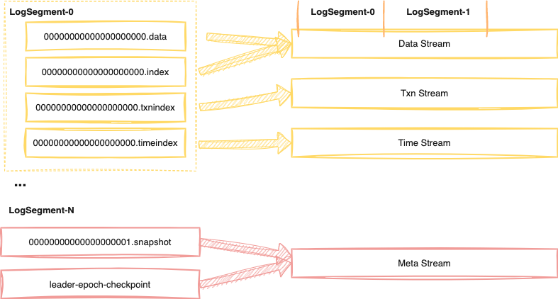

<h1 align="center">
AutoMQ for Apache Kafka
</h1>
<h3 align="center">
    The truly serverless Kafka solution that maximizes the benefits of cloud
</h3>

## What is AutoMQ for Apache Kafka
AutoMQ for Apache Kafka is redesigned based on cloud infrastructure, and users 
benefit from 
**elastic computing resources** and nearly **unlimited cheap storage** in 
the cloud. It is developed based on Apache Kafka and unload Kafka's storage to object storage(S3). This design allows Kafka Brokers to become stateless and could scale up/down in seconds. And by making targeted modifications at the LogSegment level and extensively reusing upper-level code, it guarantees **100% functional compatibility**.

Compared to Apache Kafka, AutoMQ for Apache Kafka offers the following advantages:

1. Enhanced Scalability: It leverages cloud-native infrastructure and stateless Kafka Brokers, enabling seamless scaling to meet varying workloads. This elasticity allows for efficient resource allocation and ensures optimal performance even during peak periods.

2. Cost Efficiency: By utilizing S3, it could save storage cost up to 70%; By leveraging serverless architecture and dynamically scaling based on workload, it can achieve significant cost savings of up to 80% in compute expenses.

3. Simplified Management: It automatically balances the distribution of partitions across brokers in seconds. This streamlines operations, reduces administrative overhead, and allows IT teams to focus on higher-value tasks.


## Quick Start
### Run in Docker
You can start AutoMQ for Apache Kafka with Docker Compose by configuring a docker-compose.yml file.
#### Prerequisites
- [Docker](https://docs.docker.com/get-docker/)
- [Docker-compose](https://docs.docker.com/compose/install/)

#### Run with docker-compose
1. change dir to docker
``` shell
cd docker
```
2. start AutoMQ for Apache Kafka
``` shell
docker compose up -d
```

#### Produce and Consume messages
1. login to broker container
``` shell
docker exec -it broker1 bash
```

2. Create a topic to store your messages:
``` shell
# move into kafka dir
$ cd /opt/kafka/kafka
# create a topic
$ bin/kafka-topics.sh --create --topic quickstart-events --bootstrap-server $(hostname -I | awk '{print $1}'):9092
```

3. Run the console producer client to write a few messages into your topic. By default, each line you enter will result in a separate message being written to the topic.
``` shell
$ bin/kafka-console-producer.sh --topic quickstart-events --bootstrap-server $(hostname -I | awk '{print $1}'):9092
```
You may input some messages like:
``` shell
This is my first event
This is my second event
```

4. Open another terminal session and run the console consumer client to read the messages you just created:
``` shell
$ bin/kafka-console-consumer.sh --topic quickstart-events --from-beginning --bootstrap-server $(hostname -I | awk '{print $1}'):9092
```
You will see the messages you input in step 2.
``` shell
This is my first event
This is my second event
```

#### Stop with docker-compose
``` shell
docker compose down -v
```

### Build and Run
#### Prerequisites
- JDK 17
- Scala 2.13

AutoMQ for Apache Kafka requires S3 for data storage. If you want to set up locally, you can use [localstack](https://github.com/localstack/localstack) instead, bringing about following prerequisites:
- [Docker](https://docs.docker.com/get-docker/)

#### Build a jar
``` shell
./gradlew jar -x test
```

#### Run a storage container
In reference to [localstack-quick-start](https://docs.localstack.cloud/getting-started/installation/#docker), run localstack in docker:
``` shell
docker run \
  --rm -it \
  -p 4566:4566 \
  -p 4510-4559:4510-4559 \
  localstack/localstack
```

#### Launch AutoMQ for Apache Kafka
Firstly, you may have to change the 's3.endpoint' setting in config/kraft/server.properties to your localstack endpoint, like: http://127.0.0.1:4566.

Then, you can start AutoMQ for Apache Kafka with the following commands:
``` shell
# start a broker in kraft mode
$ KAFKA_CLUSTER_ID="$(./bin/kafka-storage.sh random-uuid)"

$ bin/kafka-storage.sh format -t $KAFKA_CLUSTER_ID -c config/kraft/server.properties

$ bin/kafka-server-start.sh config/kraft/server.properties
```

#### Produce and Consume messages
1. Create a topic to store your messages:
``` shell
$ bin/kafka-topics.sh --create --topic quickstart-events --bootstrap-server localhost:9092
```

2. Run the console producer client to write a few messages into your topic. By default, each line you enter will result in a separate message being written to the topic.
``` shell
$ bin/kafka-console-producer.sh --topic quickstart-events --bootstrap-server localhost:9092
```
You may input some messages like:
``` shell
This is my first event
This is my second event
```

3. Open another terminal session and run the console consumer client to read the messages you just created:
``` shell
$ bin/kafka-console-consumer.sh --topic quickstart-events --from-beginning --bootstrap-server localhost:9092
```
You will see the messages you input in step 2.
``` shell
This is my first event
This is my second event
```
ref. [Quick Start](https://kafka.apache.org/quickstart#quickstart_send)

After run producer and consumer, you can check Kafka local store path /tmp/kraft-combined-logs/quickstart-events-0, you will find there is no local data for quickstart-events.
> Note: xxx.timeindex is only the local cache for read accelerate,
> the real data is stored in S3.

## Design
### Architecture


### Data Mapping


