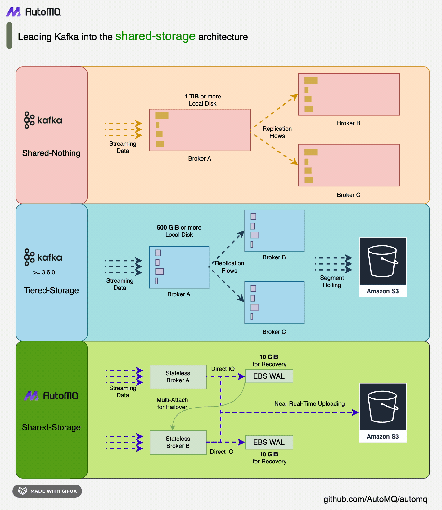
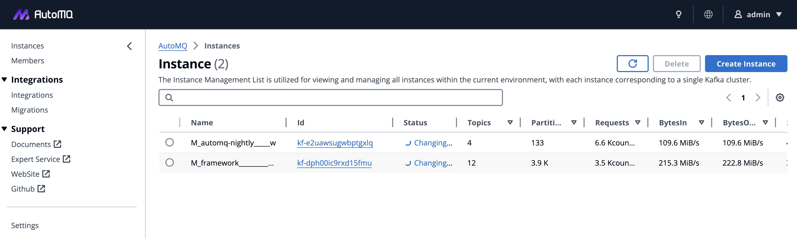

## AutoMQ: A Cloud-First Alternative of Kafka by decoupling durability to S3 and EBS

</div>

<p align="center">
  🔥&nbsp <a
    href="https://www.automq.com/quick-start#Cloud?utm_source=github_automq_cloud"
    target="_blank"
  ><b>Free trail of AutoMQ Cloud</b></a>&nbsp&nbsp&nbsp
  📑&nbsp <a
    href="https://docs.automq.com/docs/automq-opensource/HSiEwHVfdiO7rWk34vKcVvcvn2Z?utm_source=github"
    target="_blank"
  ><b>Documentation</b></a>


</p>


[](https://docs.automq.com/docs/automq-s3kafka/YUzOwI7AgiNIgDk1GJAcu6Uanog)
[-yellow)](https://www.automq.com/blog/automq-vs-apache-kafka-a-real-aws-cloud-bill-comparison)
[-orange)](https://docs.automq.com/docs/automq-opensource/IJLQwnVROiS5cUkXfF0cuHnWnNd)
[](https://twitter.com/intent/follow?screen_name=AutoMQ_Lab)
[](docs/images/automq-wechat.png)
[](https://join.slack.com/t/automq/shared_invite/zt-29h17vye9-thf31ebIVL9oXuRdACnOIA)


---


## 🍵 AutoMQ vs Other Streaming Platforms

<table>
  <tr>
    <th>Feature</th>
    <th>AutoMQ</th>
    <th>Apache Kafka</th>
    <th>Confluent</th>
    <th>Apache Pulsar</th>
    <th>Redpanda</th>
    <th>Warpstream</th>
  </tr>
  <tr>
    <td>Apache Kafka Compatibility[1]</td>
    <td colspan="3">Native Kafka</td>
    <td>Non-Kafka</td>
    <td colspan="2">Kafka Protocol</td>
  </tr>
  <tr>
    <td>Source Code Availability</td>
    <td>Yes</td>
    <td>Yes</td>
    <td>No</td>
    <td>Yes</td>
    <td>Yes</td>
    <td>No</td>
  </tr>
  <tr>
    <td>Stateless Broker</td>
    <td>Yes</td>
    <td>No</td>
    <td>No</td>
    <td>Yes</td>
    <td>No</td>
    <td>Yes</td>
  </tr>
  <tr>
    <td>Publisher Latency(P99)</td>
    <td colspan="5">Single-digit ms latency</td>
    <td><a href="https://www.warpstream.com/blog/warpstream-benchmarks-and-tco">> 620ms</a></td>
  </tr>
  <tr>
    <td>Continuous Self-Balancing</td>
    <td>Yes</td>
    <td>No</td>
    <td>Yes</td>
    <td>Yes</td>
    <td>Yes</td>
    <td>Yes</td>
  </tr>
  <tr>
    <td>Scale in/out</td>
    <td>In seconds</td>
    <td>In hours/days</td>
    <td>In hours</td>
    <td>In hours<br>(scale-in);<br> In seconds<br>(scale-out)</td>
    <td>In hours<br>In seconds (Enterprise Only)</td>
    <td>In seconds</td>
  </tr>
  <tr>
    <td>Spot Instance Support</td>
    <td>Yes</td>
    <td>No</td>
    <td>No</td>
    <td>No</td>
    <td>No</td>
    <td>Yes</td>
  </tr>
  <tr>
    <td>Partition Reassignment</td>
    <td>In seconds</td>
    <td>In hours/days</td>
    <td>In hours</td>
    <td>In seconds</td>
    <td>In hours<br>In seconds (Enterprise Only)</td>
    <td>In seconds</td>
  </tr>
  <tr>
    <td>Component</td>
    <td>Broker</td>
    <td colspan="2">Broker<br>Zookeeper<br>(Non-KRaft)</td>
    <td>Broker<br>Zookeeper<br>Bookkeeper<br>Proxy(Optional)</td>
    <td>Broker</td>
    <td>Agent<br>MetadataServer</td>
  </tr>
  <tr>
    <td>Durability</td>
    <td>Guaranteed by S3/EBS[2]</td>
    <td colspan="2">Guaranteed by ISR </td>
    <td>Guaranteed by Bookkeeper</td>
    <td>Guaranteed by Raft</td>
    <td>Guaranteed by S3</td>
  </tr>
  <tr>
    <td>Inter-AZ Networking Fees</td>
    <td>No</td>
    <td colspan="4">Yes</td>
    <td>No</td>
  </tr>
</table>


> [1] Apache Kafka Compatibility's definition is coming from this [blog](https://www.kai-waehner.de/blog/2021/05/09/kafka-api-de-facto-standard-event-streaming-like-amazon-s3-object-storage/).

> [2] EBS Durability: On Azure, GCP, and Alibaba Cloud, Regional EBS replicas span multiple AZs. On AWS, ensure durability by double writing to EBS and S3 Express One Zone in different AZs.

## 🔶 Why AutoMQ

- **Cost effective**: The first true cloud-native streaming storage system, designed for optimal cost and efficiency on the cloud. Refer to [this report](https://docs.automq.com/docs/automq-opensource/EV6mwoC95ihwRckMsUKcppnqnJb) to see how we cut Apache Kafka billing by 90% on the cloud.
- **High Reliability**: Leverage cloud-shared storage services(EBS and S3) to achieve zero RPO, RTO in seconds and 99.999999999% durability.
- **Serverless**:
  - Auto Scaling: Monitor cluster metrics and automatically scale in/out to align with your workload, enabling a pay-as-you-go model.
  - Scaling in seconds: The computing layer (broker) is stateless and can scale in/out within seconds, making AutoMQ a truly serverless solution.
  - Infinite scalable: Utilize cloud object storage as the primary storage solution, eliminating concerns about storage capacity.
- **Manage-less**: The built-in auto-balancer component automatically schedules partitions and network traffic between brokers, eliminating manual partition reassignment.
- **High performance**:
  - Low latency: Accelerate writing with high-performance EBS as WAL, achieving single-digit millisecond latency.
  - High throughput: Leverage pre-fetching, batch processing, and parallel technologies to maximize the capabilities of cloud object storage.
  > Refer to the [AutoMQ Performance White Paper](https://docs.automq.com/docs/automq-opensource/IJLQwnVROiS5cUkXfF0cuHnWnNd) to see how we achieve this.
- **A superior alternative to Apache Kafka**: 100% compatible with Apache Kafka and does not lose any key features, but cheaper and better.

## ✨Architecture



AutoMQ adopts a Shared-Storage architecture, replacing the storage layer of Apache Kafka with a shared streaming storage library called [S3Stream](https://github.com/AutoMQ/automq/tree/main/s3stream) in a storage-compute separation manner, making the Broker completely stateless.

Compared to the classic Kafka Shared-Nothing or Tiered-Storage architectures, AutoMQ's computing layer (Broker) is truly stateless, enabling features such as Auto-Scaling, Self-Balancing, and Partition Reassignment in Seconds that significantly reduce costs and improve efficiency.

## ⛄ Get started with AutoMQ

### Deploy Locally on a Single Host
```
curl https://download.automq.com/community_edition/standalone_deployment/install_run.sh | bash
```

The easiest way to run AutoMQ. You can experience features like **Partition Reassignment in Seconds** and **Continuous Self-Balancing** in your local machine. [Learn more](https://docs.automq.com/docs/automq-opensource/EsUBwQei4ilCDjkWb8WcbOZInwc)

There are more deployment options available:
- [Deploy on Linux with 5 Nodes](https://docs.automq.com/docs/automq-opensource/IyXrw3lHriVPdQkQLDvcPGQdnNh)
- [Deploy on Kubernetes(Enterprise Edition Only)](https://docs.automq.com/docs/automq-opensource/KJtLwvdaPi7oznkX3lkcCR7fnte)
- [Runs on Ceph / MinIO / CubeFS / HDFS](https://docs.automq.com/docs/automq-opensource/RexrwfhKuiGChfk237QcEBIwnND)
- [Try AutoMQ on Alibaba Cloud Marketplace](https://market.aliyun.com/products/55530001/cmgj00065841.html)
- [Try AutoMQ on AWS Marketplace](https://docs.automq.com/docs/automq-onperm/LEGFwYWq7is3jnkLlUBceHYCnp3)

## 💬 Community
You can join the following groups or channels to discuss or ask questions about AutoMQ:
- Ask questions or report a bug by [GitHub Issues](https://github.com/AutoMQ/automq/issues)
- Discuss about AutoMQ or Kafka by [Slack](https://join.slack.com/t/automq/shared_invite/zt-29h17vye9-thf31ebIVL9oXuRdACnOIA) or [Wechat Group](docs/images/automq-wechat.png)


## 👥 How to contribute
If you've found a problem with AutoMQ, please open a [GitHub Issues](https://github.com/AutoMQ/automq/issues).
To contribute to AutoMQ please see [Code of Conduct](CODE_OF_CONDUCT.md) and [Contributing Guide](CONTRIBUTING_GUIDE.md).
We have a list of [good first issues](https://github.com/AutoMQ/automq/issues?q=is%3Aissue+is%3Aopen+label%3A%22good+first+issue%22) that help you to get started, gain experience, and get familiar with our contribution process. To claim one, simply reply with 'pick up' in the issue and the AutoMQ maintainers will assign the issue to you. If you have any questions about the 'good first issue' please feel free to ask. We will do our best to clarify any doubts you may have.

## AutoMQ Business Edition
The business edition of AutoMQ provides a powerful and easy-to-use control plane to help you manage clusters effortlessly. Meanwhile, the control plane is more powerful in terms of availability and observability compared to the community version.

> You can check the difference between the community and business editions [here](https://www.automq.com/product).



### Free trial of AutoMQ Business Edition
To allow users to experience the capabilities of the AutoMQ business edition without any barriers, click [here](https://www.automq.com/quick-start#Cloud?utm_source=github_automq_cloud) to apply for a no-obligation cluster trial, and note `AutoMQ Cloud Free Trial` in the message input box. We will immediately initialize an AutoMQ Cloud control panel for you soon in the cloud and give you the address of the control panel. Then, you can use the control panel to create a AutoMQ cluster or perform operations like scale in/out. 

No need to bind a credit card, no cost at all. We look forward to receiving valuable feedback from you to make our product better. If you want to proceed with a formal POC, you can also contact us through [Contact Us](https://automq66.feishu.cn/share/base/form/shrcnoqxslhYkujx6ULiMxOqkGh?utm_source=github_poc). We will further support your official POC.

## 🙋 Contact Us
Want to learn more, [Talk with our product experts](https://automq66.feishu.cn/share/base/form/shrcnoqxslhYkujx6ULiMxOqkGh).
