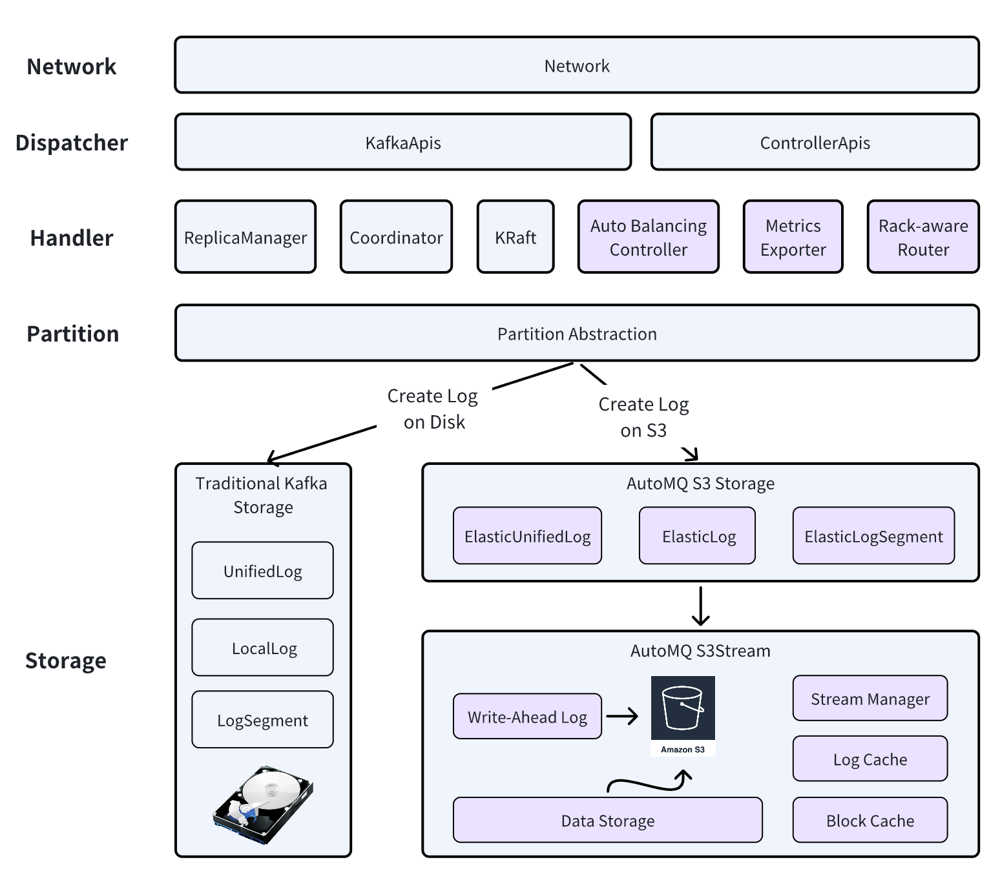

# A Diskless Kafka® on S3, Offering 10x Cost Savings and Scaling in Seconds.

<div align="center">
<p align="center">
  📑&nbsp <a
    href="https://www.automq.com/docs/automq/what-is-automq/overview?utm_source=github_automq"
    target="_blank"
  ><b>Documentation</b></a>&nbsp&nbsp&nbsp
  🔥&nbsp <a
    href="https://www.automq.com/docs/automq-cloud/getting-started/install-byoc-environment/aws/install-env-from-marketplace?utm_source=github_automq"
    target="_blank"
  ><b>Free trial of AutoMQ on AWS</b></a>&nbsp&nbsp&nbsp
</p>

[](https://www.linkedin.com/company/automq)
[](https://join.slack.com/t/automq/shared_invite/zt-29h17vye9-thf31ebIVL9oXuRdACnOIA)
[-yellow)](https://www.automq.com/blog/automq-vs-apache-kafka-a-real-aws-cloud-bill-comparison?utm_source=github_automq)
[-orange)](https://www.automq.com/docs/automq/benchmarks/automq-vs-apache-kafka-benchmarks-and-cost?utm_source=github_automq)
[](https://gurubase.io/g/automq)
[![DeepWiki](https://img.shields.io/badge/DeepWiki-AutoMQ%2Fautomq-blue.svg?logo=data:image/png;base64,iVBORw0KGgoAAAANSUhEUgAAACwAAAAyCAYAAAAnWDnqAAAAAXNSR0IArs4c6QAAA05JREFUaEPtmUtyEzEQhtWTQyQLHNak2AB7ZnyXZMEjXMGeK/AIi+QuHrMnbChYY7MIh8g01fJoopFb0uhhEqqcbWTp06/uv1saEDv4O3n3dV60RfP947Mm9/SQc0ICFQgzfc4CYZoTPAswgSJCCUJUnAAoRHOAUOcATwbmVLWdGoH//PB8mnKqScAhsD0kYP3j/Yt5LPQe2KvcXmGvRHcDnpxfL2zOYJ1mFwrryWTz0advv1Ut4CJgf5uhDuDj5eUcAUoahrdY/56ebRWeraTjMt/00Sh3UDtjgHtQNHwcRGOC98BJEAEymycmYcWwOprTgcB6VZ5JK5TAJ+fXGLBm3FDAmn6oPPjR4rKCAoJCal2eAiQp2x0vxTPB3ALO2CRkwmDy5WohzBDwSEFKRwPbknEggCPB/imwrycgxX2NzoMCHhPkDwqYMr9tRcP5qNrMZHkVnOjRMWwLCcr8ohBVb1OMjxLwGCvjTikrsBOiA6fNyCrm8V1rP93iVPpwaE+gO0SsWmPiXB+jikdf6SizrT5qKasx5j8ABbHpFTx+vFXp9EnYQmLx02h1QTTrl6eDqxLnGjporxl3NL3agEvXdT0WmEost648sQOYAeJS9Q7bfUVoMGnjo4AZdUMQku50McDcMWcBPvr0SzbTAFDfvJqwLzgxwATnCgnp4wDl6Aa+Ax283gghmj+vj7feE2KBBRMW3FzOpLOADl0Isb5587h/U4gGvkt5v60Z1VLG8BhYjbzRwyQZemwAd6cCR5/XFWLYZRIMpX39AR0tjaGGiGzLVyhse5C9RKC6ai42ppWPKiBagOvaYk8lO7DajerabOZP46Lby5wKjw1HCRx7p9sVMOWGzb/vA1hwiWc6jm3MvQDTogQkiqIhJV0nBQBTU+3okKCFDy9WwferkHjtxib7t3xIUQtHxnIwtx4mpg26/HfwVNVDb4oI9RHmx5WGelRVlrtiw43zboCLaxv46AZeB3IlTkwouebTr1y2NjSpHz68WNFjHvupy3q8TFn3Hos2IAk4Ju5dCo8B3wP7VPr/FGaKiG+T+v+TQqIrOqMTL1VdWV1DdmcbO8KXBz6esmYWYKPwDL5b5FA1a0hwapHiom0r/cKaoqr+27/XcrS5UwSMbQAAAABJRU5ErkJggg==)](https://deepwiki.com/AutoMQ/automq)

<a href="https://trendshift.io/repositories/9782" target="_blank"></a>
</div>

<div align="center">
    


<a href="https://www.youtube.com/watch?v=IB8sh639Rsg" target="_blank">
    
</a> 
<a href="https://www.automq.com/blog/jdcom-automq-cubefs-trillion-scale-kafka-messaging" target="_blank">
    
</a> 
<a href="https://www.automq.com/blog/automq-help-geely-auto-solve-the-pain-points-of-kafka-elasticity-in-the-v2x-scenario" target="_blank">
    
</a>
<a href="https://www.automq.com/blog/dewu-builds-trillion-level-monitoring-system-based-on-automq" target="_blank">
    
</a> 
<a href="https://www.automq.com/customer" target="_blank">
    
</a> 
<a href="https://www.automq.com/customer" target="_blank">
    
</a> 
<a href="https://www.automq.com/blog/automq-vs-kafka-evaluation-and-comparison-by-little-red-book" target="_blank">
    
</a> 
<a href="https://www.automq.com/blog/xpeng-motors-reduces-costs-by-50-by-replacing-kafka-with-automq" target="_blank">
    
</a> 
<a href="https://www.automq.com/customer" target="_blank">
    
</a> 
<a href="https://www.automq.com/customer" target="_blank">
    
</a>
</div>


- [Grab: Driving Efficiency with AutoMQ in DataStreaming Platform](https://www.youtube.com/watch?v=IB8sh639Rsg)
- [JD.com x AutoMQ x CubeFS: A Cost-Effective Journey](https://www.automq.com/blog/jdcom-automq-cubefs-trillion-scale-kafka-messaging?utm_source=github_automq)
- [Palmpay Uses AutoMQ to Replace Kafka, Optimizing Costs by 50%+](https://www.automq.com/blog/palmpay-uses-automq-to-replace-kafka?utm_source=github_automq)
- [AutoMQ help Geely Auto(Fortune Global 500) solve the pain points of Kafka elasticity in the V2X scenario](https://www.automq.com/blog/automq-help-geely-auto-solve-the-pain-points-of-kafka-elasticity-in-the-v2x-scenario?utm_source=github_automq)
- [How Asia’s Quora Zhihu uses AutoMQ to reduce Kafka cost and maintenance complexity](https://www.automq.com/blog/how-asias-quora-zhihu-use-automq-to-reduce-kafka-cost-and-maintenance-complexity?utm_source=github_automq)
- [XPENG Motors Reduces Costs by 50%+ by Replacing Kafka with AutoMQ](https://www.automq.com/blog/xpeng-motors-reduces-costs-by-50-by-replacing-kafka-with-automq?utm_source=github_automq)
- [Asia's GOAT, Poizon uses AutoMQ Kafka to build observability platform for massive data(30 GB/s)](https://www.automq.com/blog/asiax27s-goat-poizon-uses-automq-kafka-to-build-a-new-generation-observability-platform-for-massive-data?utm_source=github_automq)
- [AutoMQ Helps CaoCao Mobility Address Kafka Scalability During Holidays](https://www.automq.com/blog/automq-helps-caocao-mobility-address-kafka-scalability-issues-during-mid-autumn-and-national-day?utm_source=github_automq)

## ⛄ Get started with AutoMQ

> [!Tip]
> Deploying a production-ready AutoMQ cluster is challenging. This Quick Start is only for evaluating AutoMQ features and is not suitable for production use. For production deployment best practices, please [contact](https://www.automq.com/contact) our community for support.

The `docker/docker-compose.yaml` file provides a simple single-node setup for quick evaluation and development:
```shell
curl -O https://raw.githubusercontent.com/AutoMQ/automq/refs/tags/1.5.5/docker/docker-compose.yaml && docker compose -f docker-compose.yaml up -d
```
This setup features a single AutoMQ node serving as both controller and broker, alongside MinIO for S3 storage. All services operate within a Docker bridge network called `automq_net`, allowing you to start a Kafka producer in this network to test AutoMQ:
```shell
docker run --network automq_net automqinc/automq:latest /bin/bash -c \
"/opt/automq/kafka/bin/kafka-producer-perf-test.sh --topic test-topic --num-records=1024000 --throughput 5120 --record-size 1024 \
--producer-props bootstrap.servers=server1:9092 linger.ms=100 batch.size=524288 buffer.memory=134217728 max.request.size=67108864"
```
After testing, you can destroy the setup with:
```shell
docker compose -f docker-compose.yaml down
```
The `docker/docker-compose-cluster.yaml` file offers a more complex setup with three AutoMQ nodes, ideal for testing AutoMQ's cluster features, and can be run in the same way.

There are more deployment options available:
- [Deploy Multi-Nodes Test Cluster on Docker](https://www.automq.com/docs/automq/getting-started/deploy-multi-nodes-test-cluster-on-docker?utm_source=github_automq)
- [Deploy on Linux with 5 Nodes](https://www.automq.com/docs/automq/deployment/deploy-multi-nodes-cluster-on-linux?utm_source=github_automq)
- [Deploy on Kubernetes](https://www.automq.com/docs/automq/deployment/deploy-multi-nodes-cluster-on-kubernetes?utm_source=github_automq)
- [Try AutoMQ on AWS Marketplace (Two Weeks Free Trial)](https://docs.automq.com/automq-cloud/getting-started/install-byoc-environment/aws/install-env-from-marketplace?utm_source=github_automq)
- [Try AutoMQ on Alibaba Cloud Marketplace (Two Weeks Free Trial)](https://market.aliyun.com/products/55530001/cmgj00065841.html)

## 🗞️ Newest Feature - Table Topic
Table Topic is a new feature in AutoMQ that combines stream and table functionalities to unify streaming and data analysis. Currently, it supports Apache Iceberg and integrates with catalog services such as AWS Glue, HMS, and the Rest catalog. Additionally, it natively supports S3 tables, a new AWS product announced at the 2024 re:Invent. [Learn more](https://www.automq.com/blog/automq-table-topic-seamless-integration-with-s3-tables-and-iceberg?utm_source=github_automq).


## 🔶 Why AutoMQ
AutoMQ is a stateless Kafka alternative that runs on S3 or any S3-compatible storage, such as MinIO. It is designed to address two major issues of Apache Kafka. First, Kafka clusters are difficult to scale out or in due to the stateful nature of its brokers. Data movement is required, and even reassigning partitions between brokers is a complex process. Second, hosting Kafka in the cloud can be prohibitively expensive. You face high costs for EBS storage, cross-AZ traffic, and significant over-provisioning due to Kafka's limited scalability.

Here are some key highlights of AutoMQ that make it an ideal choice to replace your Apache Kafka cluster, whether in the cloud or on-premise, as long as you have S3-compatible storage:
- **Cost effective**: The first true cloud-native streaming storage system, designed for optimal cost and efficiency on the cloud. Refer to [this report](https://www.automq.com/docs/automq/benchmarks/cost-effective-automq-vs-apache-kafka?utm_source=github_automq) to see how we cut Apache Kafka billing by 90% on the cloud.
- **High Reliability**: Leverage object storage service to achieve zero RPO, RTO in seconds and 99.999999999% durability.
- **Zero Cross-AZ Traffic**: By using cloud object storage as the priority storage solution, AutoMQ eliminates cross-AZ traffic costs on AWS and GCP. In traditional Kafka setups, over 80% of costs arise from cross-AZ traffic, including producer, consumer, and replication sides.
- **Serverless**:
    - Auto Scaling: Monitor cluster metrics and automatically scale in/out to align with your workload, enabling a pay-as-you-go model.
    - Scaling in seconds: The computing layer (broker) is stateless and can scale in/out within seconds, making AutoMQ a truly serverless solution.
    - Infinite scalable: Utilize cloud object storage as the primary storage solution, eliminating concerns about storage capacity.
- **Manage-less**: The built-in auto-balancer component automatically schedules partitions and network traffic between brokers, eliminating manual partition reassignment.
- **High performance**:
    - High throughput: Leverage pre-fetching, batch processing, and parallel technologies to maximize the capabilities of cloud object storage. Refer to the [AutoMQ Performance White Paper](https://www.automq.com/docs/automq/benchmarks/automq-vs-apache-kafka-benchmarks-and-cost?utm_source=github_automq) to see how we achieve this.
    - Low Latency: AutoMQ defaults to running on S3 directly, resulting in hundreds of milliseconds of latency. The enterprise version offers single-digit millisecond latency. [Contact us](https://www.automq.com/contact?utm_source=github_automq) for more details.
- **Built-in Metrics Export**: Natively export Prometheus and OpenTelemetry metrics, supporting both push and pull. Ditch inefficient JMX and monitor your cluster with modern tools. Refer to [full metrics list](https://www.automq.com/docs/automq/observability/metrics?utm_source=github_automq) provided by AutoMQ.
- **100% Kafka Compatible**: Fully compatible with Apache Kafka, offering all features with greater cost-effectiveness and operational efficiency.

## ✨Architecture
AutoMQ is a fork of the open-source [Apache Kafka](https://github.com/apache/kafka). We've introduced a new storage engine based on object storage, transforming the classic shared-nothing architecture into a shared storage architecture.



Regarding the architecture of AutoMQ, it is fundamentally different from Kafka. The core difference lies in the storage layer of Apache Kafka and how we leverage object storage to achieve a stateless broker architecture. AutoMQ consists of below key components:
- S3 Storage Adapter: an adapter layer that reimplements the UnifiedLog, LocalLog, and LogSegment classes to create logs on S3 instead of a local disk. Traditional local disk storage is still supported if desired.
- S3Stream: a shared streaming storage library that encapsulates various storage modules, including WAL and object storage. WAL is a write-ahead log optimized for frequent writes and low IOPS to reduce S3 API costs. To boost read performance, we use LogCache and BlockCache for improved efficiency.
- Auto Balancer: a component that automatically balances traffic and partitions between brokers, eliminating the need for manual reassignment. Unlike Kafka, this built-in feature removes the need for cruise control.
- Rack-aware Router: Kafka has long faced cross-AZ traffic fees on AWS and GCP. Our shared storage architecture addresses this by using a rack-aware router to provide clients in different AZs with specific partition metadata, avoiding cross-AZ fees while exchanging data through object storage.

For more on AutoMQ's architecture, visit [AutoMQ Architecture](https://www.automq.com/docs/automq/architecture/overview?utm_source=github_automq) or explore the source code directly.

## 🌟 Stay Ahead
Star AutoMQ on GitHub for instant updates on new releases.


## 💬 Community
You can join the following groups or channels to discuss or ask questions about AutoMQ:
- Ask questions or report a bug by [GitHub Issues](https://github.com/AutoMQ/automq/issues)
- Discuss about AutoMQ or Kafka by [Slack](https://join.slack.com/t/automq/shared_invite/zt-29h17vye9-thf31ebIVL9oXuRdACnOIA) or [Wechat Group](docs/images/automq-wechat.png)


## 👥 How to contribute
If you've found a problem with AutoMQ, please open a [GitHub Issues](https://github.com/AutoMQ/automq/issues).
To contribute to AutoMQ please see [Code of Conduct](CODE_OF_CONDUCT.md) and [Contributing Guide](CONTRIBUTING_GUIDE.md).
We have a list of [good first issues](https://github.com/AutoMQ/automq/issues?q=is%3Aissue+is%3Aopen+label%3A%22good+first+issue%22) that help you to get started, gain experience, and get familiar with our contribution process.

## 👍 AutoMQ Enterprise Edition
The enterprise edition of AutoMQ offers a robust, user-friendly control plane for seamless cluster management, with enhanced availability and observability over the open-source version. Additionally, we offer [Kafka Linking](https://www.automq.com/solutions/kafka-linking?utm_source=github_automq) for zero-downtime migration from any Kafka-compatible cluster to AutoMQ.

[Contact us](https://www.automq.com/contact?utm_source=github_automq) for more information about the AutoMQ enterprise edition, and we'll gladly assist with your free trial.

## 📜 License
AutoMQ is under the Apache 2.0 license. See the [LICENSE](https://github.com/AutoMQ/automq/blob/main/LICENSE) file for details.

## 📝 Trademarks
Apache®, Apache Kafka®, Kafka®, Apache Iceberg®, Iceberg® and associated open source project names are trademarks of the Apache Software Foundation

