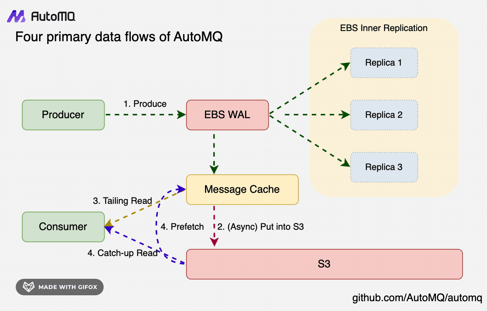
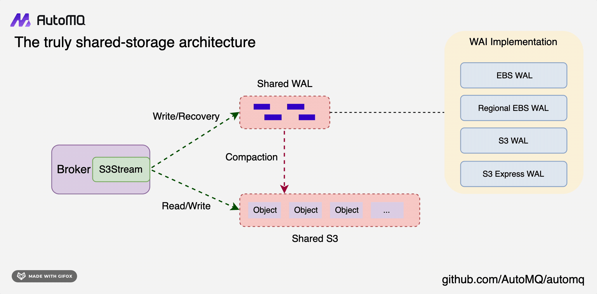

## S3Stream: A Shared Streaming Storage Library
S3Stream is a shared streaming storage library that provides a unified interface for reading and writing streaming data to cloud object storage services like Amazon S3, Google Cloud Storage, and Azure Blob Storage. EBS is utilized here for its low-latency capabilities. It is designed to be used as the storage layer for distributed systems like Apache Kafka, Apache RocketMQ, etc. It provides the following features:
* **High Reliability**: S3Stream leverages cloud storage services(EBS and S3) to achieve zero RPO, RTO in seconds and 99.999999999% durability.
* **Cost Effective**: S3Stream is designed for optimal cost and efficiency on the cloud. It can cut Apache Kafka billing by 90% on the cloud.
* **Unified Interface**: S3Stream provides a unified interface for reading and writing streaming data to cloud object storage services.
* **High Performance**: S3Stream is optimized for high performance and low latency. It can handle high throughput and low latency workloads.
* **Scalable**: S3Stream is designed to be scalable and can handle large volumes of data. It can scale horizontally to handle increasing workloads.
* **Fault Tolerant**: S3Stream is fault tolerant and can recover from failures.

## S3Stream APIs
S3Stream provides a set of APIs for reading and writing streaming data to cloud object storage services. The APIs are designed to be simple and easy to use. The following APIs are provided by S3Stream:
```java
public interface Stream {
    /**
     * Get stream id
     */
    long streamId();

    /**
     * Get stream start offset.
     */
    long startOffset();

    /**
     * Get stream next append record offset.
     */
    long nextOffset();

    /**
     * Append RecordBatch to stream.
     */
    CompletableFuture<AppendResult> append(RecordBatch recordBatch);

    /**
     * Fetch RecordBatch list from a stream. 
     */
    CompletableFuture<FetchResult> fetch(long startOffset, long endOffset, int maxBytesHint);

    /**
     * Trim stream.
     */
    CompletableFuture<Void> trim(long newStartOffset);
}
```
> Please refer to the [S3Stream API](src/main/java/com/automq/stream/api/Stream.java) for the newest API details.

## S3Stream Architecture


In S3Stream's core architecture, data is initially written to the Write-Ahead Log (WAL) persistently, then it's uploaded to S3 storage in a near real-time fashion. To efficiently support two reading paradigms—Tailing Read and Catch-up Read—S3Stream incorporates a built-in Message Cache to expedite reading operations.
- **WAL Storage**: Opt for a storage medium with low latency; each WAL disk requires only a few GiB of space, with cloud storage like EBS typically being the choice.
- **S3 Storage**: Select the cloud provider's largest object storage service to offer high-throughput, cost-effective primary data storage solutions.
- **Message Cache**: Hot data and prefetched cold data are both stored in the cache to expedite reading. Simultaneously, they are efficiently evicted based on the consumer focus mechanism, thereby enhancing memory utilization efficiency.

## Various WAL Storage Options

S3Stream supports various WAL storage options, including EBS, Regional EBS, S3, and other cloud storage services.
- **EBS WAL**: EBS is the default choice for WAL storage, offering low latency and high durability.
- **Regional EBS WAL**: On Azure, GCP, and Alibaba Cloud, Regional EBS replicas span multiple AZs.
- **S3 WAL**: Utilizing S3 as a WAL eliminates the need for EBS, streamlining the architecture to be fully S3-based, thus simplifying operations and maintenance. If your current setup is limited to MinIO, this is an excellent option.
- **S3 Express WAL**: AWS provides S3 Express, a high-performance, low-latency object storage solution that is well-suited as a storage choice for the S3Stream WAL.